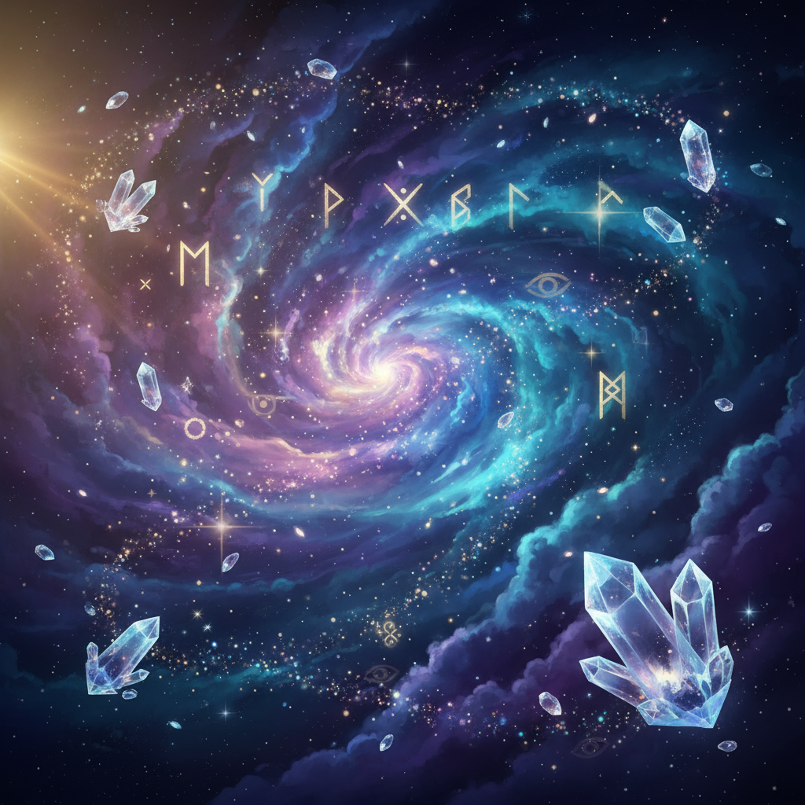

# 🔮 Mystical Fortune Teller

A beautiful, interactive web-based fortune telling experience that brings cosmic wisdom to your fingertips. Ask the mystical oracle your deepest questions and receive profound answers from the ethereal realm.

## ✨ Features

- **3 Mystical Questions**: Ask the cosmic oracle up to three profound questions
- **20 Loading Phrases**: Atmospheric mystical phrases that build suspense
- **20 Poetic Answers**: Beautiful, thoughtful responses from the cosmic realm
- **Stunning Visuals**: Cosmic background with floating crystals and runic symbols
- **Smooth Animations**: Elegant transitions, typing effects, and floating elements
- **Mobile Responsive**: Perfect experience on all devices
- **Share Results**: Share your cosmic wisdom on social media
- **Progressive Enhancement**: Works even without JavaScript

## 🎨 Design Highlights

- **Mystical Theme**: Dark cosmic background with purple and gold accents
- **Crystal Ball Animation**: Floating, glowing crystal ball centerpiece
- **Particle Effects**: Twinkling stars and floating mystical particles
- **Typography**: Elegant Cinzel and Crimson Text fonts
- **Responsive Design**: Optimized for desktop, tablet, and mobile
- **Accessibility**: Proper contrast ratios and semantic HTML

## 🚀 Getting Started

Simply open `index.html` in any modern web browser. No installation or setup required!

### Online Demo
Visit the live demo: [Add your GitHub Pages URL here]

### Local Usage
1. Download or clone this repository
2. Open `index.html` in your web browser
3. Begin your mystical journey!

## 🛠️ Technical Details

- **Pure HTML/CSS/JavaScript**: No external dependencies
- **Single File**: Everything contained in `index.html` for easy hosting
- **Modern Web Standards**: Uses CSS Grid, Flexbox, and modern JavaScript
- **Performance Optimized**: Fast loading with embedded assets
- **Cross-Browser Compatible**: Works in all modern browsers

## 🎯 Viral Features

- **Shareable Results**: Beautiful result cards perfect for social media
- **Engaging UX**: Smooth animations and suspenseful timing
- **Mobile-First**: Optimized for social media sharing on mobile devices
- **Memorable Experience**: Atmospheric design that users want to share

## 📱 Social Media Integration

The app includes built-in sharing functionality that works with:
- Native Web Share API (mobile devices)
- Clipboard copying (desktop fallback)
- Optimized for Twitter, Facebook, and Instagram sharing

## 🎨 Customization

The design can be easily customized by modifying the CSS variables:
- Colors: Update the gradient and accent colors
- Fonts: Change the Google Fonts imports
- Animations: Adjust timing and effects in the CSS animations
- Content: Modify the loading phrases and answers arrays in JavaScript

## 📄 License

This project is licensed under the MIT License - see the [LICENSE](LICENSE) file for details.

## 🌟 Credits

- **Original Concept**: Based on a C++ fortune telling application
- **Design & Development**: Enhanced for web with modern UI/UX principles
- **Fonts**: Google Fonts (Cinzel, Crimson Text)
- **Background**: AI-generated mystical cosmic imagery

## 🔮 About the Oracle

The Mystical Fortune Teller draws upon ancient wisdom and cosmic energy to provide guidance for your life's questions. Each answer is carefully crafted to inspire reflection and provide meaningful insight into your journey.

*"The future belongs to those who believe in the beauty of their dreams."*

---

Made with ✨ and cosmic energy

